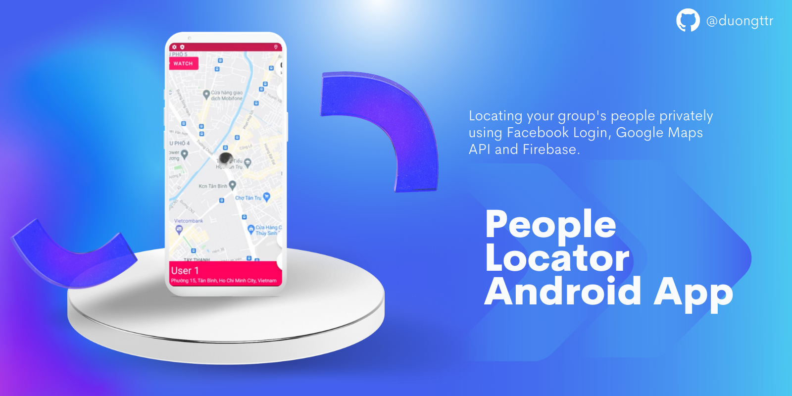

# People Locator Android App
An open-source Android app for locating your group's people privately using **Facebook Login**, **Google Maps API** and **Firebase**.

👉 Watch <a href="https://www.youtube.com/watch?v=iyg9kZ4OKqo">Youtube Video</a>

# Need to do
1. Follow steps for creating a new project on [Firebase](firebase.com) and replace the `google-services.json` file inside `app` folder.
2. Generate an Google Maps API key by following [this instruction](https://developers.google.com/maps/documentation/android-sdk).
3. Generate an Facebook app for using [Facebook Login API](https://developers.facebook.com/docs/facebook-login/android/).

# Contact me
[Email](mailto:duong.jt.19@gmail.com)

